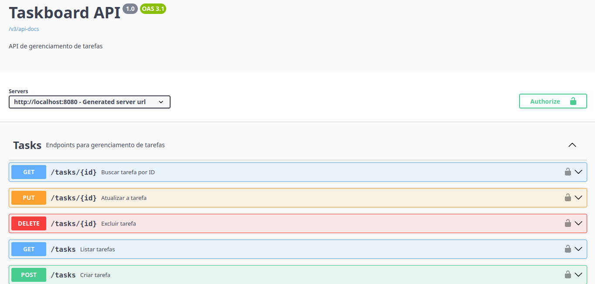

# 🚀 TaskBoard API


[](https://github.com/Rshinna/taskboard-api/actions/workflows/ci.yml)

API REST para gerenciamento de tarefas com autenticação JWT, desenvolvida com Java e Spring Boot.

O projeto foi desenvolvido com foco em boas práticas de desenvolvimento backend, incluindo autenticação baseada em JWT, controle de acesso por roles (RBAC), proteção contra força bruta, migrações de banco versionadas, paginação, testes automatizados e documentação de API.

---

## ✅ Funcionalidades Implementadas

- [x] Cadastro de usuários
- [x] Autenticação com JWT
- [x] Controle de acesso baseado em roles (RBAC)
- [x] CRUD completo de tarefas
- [x] Paginação e ordenação de tarefas
- [x] Filtro de tarefas por status
- [x] Isolamento de tarefas por usuário
- [x] Validação de dados
- [x] Tratamento global de exceções com logging estruturado
- [x] Proteção contra força bruta no login (Rate Limiting)
- [x] Migrações de banco versionadas com Flyway
- [x] Documentação com Swagger/OpenAPI
- [x] Testes unitários e de integração (48 testes)
- [x] CI/CD com GitHub Actions
- [x] Docker e Docker Compose

---

## 🛠 Tecnologias

- Java 21
- Spring Boot 3
- Spring Security
- JWT (jjwt)
- Spring Data JPA
- PostgreSQL
- Flyway
- Bucket4j (Rate Limiting)
- H2 Database (testes)
- JUnit 5
- Mockito
- Maven
- Docker / Docker Compose
- Swagger / OpenAPI
- GitHub Actions

---

## 🏗 Arquitetura

```text
src/main/java/com/rshinna/taskboardapi
├── auth
│   ├── controller
│   ├── dto
│   ├── security
│   └── service
├── config
├── controller
├── dto
├── entity
├── exception
├── repository
├── service
└── TaskboardApiApplication
```

---

## 🔗 Endpoints

### Usuários

| Método | Endpoint | Descrição | Acesso |
|--------|----------|-----------|--------|
| POST | `/users` | Criar usuário | Público |
| GET | `/users/me` | Dados do usuário autenticado | Autenticado |
| GET | `/users/admin` | Endpoint restrito a admins | Somente ADMIN |
| PATCH | `/users/{id}/promote` | Promove um usuário para ADMIN | Somente ADMIN |

O projeto implementa controle de acesso baseado em papéis (RBAC), com duas roles: `USER` (padrão, atribuída automaticamente no cadastro) e `ADMIN` (atribuída apenas via `/users/{id}/promote`, por um usuário já admin).

### Autenticação

| Método | Endpoint | Descrição | Acesso |
|--------|----------|-----------|--------|
| POST | `/auth/login` | Realizar login | Público |

O endpoint de login possui proteção contra força bruta: máximo de **5 tentativas por IP a cada 1 minuto**. Após isso, retorna `429 Too Many Requests`.

### Tarefas

| Método | Endpoint | Descrição | Acesso |
|--------|----------|-----------|--------|
| POST | `/tasks` | Criar tarefa | Autenticado |
| GET | `/tasks` | Listar tarefas do usuário | Autenticado |
| GET | `/tasks/{id}` | Buscar tarefa por ID | Autenticado |
| PUT | `/tasks/{id}` | Atualizar tarefa | Autenticado |
| DELETE | `/tasks/{id}` | Remover tarefa | Autenticado |

Todos os endpoints de tarefas exigem autenticação JWT. Cada usuário acessa apenas suas próprias tarefas.

#### Paginação e filtros

```
GET /tasks?page=0&size=10&sort=createdAt,desc
GET /tasks?status=PENDING
GET /tasks?status=IN_PROGRESS&page=0&size=5
```

Valores de status disponíveis: `PENDING`, `IN_PROGRESS`, `COMPLETED`.

---

## ⚙️ Configuração

A aplicação utiliza as seguintes variáveis de ambiente:

```env
DB_URL=jdbc:postgresql://localhost:5432/taskboard
DB_USERNAME=postgres
DB_PASSWORD=postgres
JWT_SECRET=sua-chave-secreta
```

### Exemplo Linux/macOS

```bash
export DB_URL=jdbc:postgresql://localhost:5432/taskboard
export DB_USERNAME=postgres
export DB_PASSWORD=postgres
export JWT_SECRET=minha-chave-super-secreta
```

### Exemplo Windows (PowerShell)

```powershell
$env:DB_URL="jdbc:postgresql://localhost:5432/taskboard"
$env:DB_USERNAME="postgres"
$env:DB_PASSWORD="postgres"
$env:JWT_SECRET="minha-chave-super-secreta"
```

---

## 📦 Pré-requisitos

**Opção A — com Docker (recomendado):**
- Docker e Docker Compose

**Opção B — execução local sem Docker:**
- Java 21 ou superior
- Maven 3.8 ou superior
- PostgreSQL

---

## ▶️ Executando Localmente

### Clone o projeto

```bash
git clone https://github.com/Rshinna/taskboard-api.git
cd taskboard-api
```

### Opção A — com Docker (recomendado)

Sobe o Postgres e a aplicação juntos, sem precisar instalar Java, Maven ou Postgres na máquina:

```bash
docker compose up --build
```

Pra derrubar:

```bash
docker compose down          # mantém os dados do banco
docker compose down -v       # remove também o volume do banco
```

### Opção B — execução local sem Docker

Configure as variáveis de ambiente (ver seção [Configuração](#️-configuração)) e execute:

```bash
mvn spring-boot:run
```

### Acessando a aplicação

Em qualquer uma das opções, a aplicação ficará disponível em:

```text
http://localhost:8080
```

---

## 🧪 Executando os Testes

Executar todos os testes:

```bash
mvn test
```

Executar uma classe específica:

```bash
mvn test -Dtest=TaskServiceTest
```

---

## 📋 Testes

O projeto conta com **48 testes automatizados**, cobrindo as camadas de serviço, segurança e integração.

### Testes Unitários

| Classe | Cobertura |
|--------|-----------|
| `TaskServiceTest` | CRUD de tarefas, paginação, filtro por status |
| `UserServiceTest` | Cadastro, promoção, prevenção de escalação de privilégio |
| `AuthServiceTest` | Autenticação, credenciais inválidas |
| `JwtServiceTest` | Geração, validação e extração de token |
| `AuthenticatedUserServiceTest` | Recuperação do usuário autenticado |
| `CustomUserDetailsServiceTest` | Carregamento de usuário por email |
| `RateLimitFilterTest` | Limite de tentativas e bloqueio por IP |

### Testes de Integração

| Classe | Cobertura |
|--------|-----------|
| `TaskControllerIntegrationTest` | Fluxo completo de tasks, autenticação, isolamento entre usuários, filtro por status |
| `GlobalExceptionHandlerTest` | Respostas 404, 403 e 400 |
| `AuthControllerTest` | Login com sucesso e credenciais inválidas |

---

## 📚 Swagger

Após iniciar a aplicação:

```text
http://localhost:8080/swagger-ui/index.html
```



---

## 🔐 Segurança

A autenticação é baseada em JWT. Exemplo de header:

```http
Authorization: Bearer <token>
```

- Cada usuário acessa apenas suas próprias tarefas (prevenção de IDOR)
- O acesso a endpoints administrativos é controlado via `@PreAuthorize` com base na role (`USER` ou `ADMIN`)
- Todo usuário nasce com role `USER`; a promoção a `ADMIN` ocorre apenas via `/users/{id}/promote`, restrito a administradores
- O endpoint de login possui rate limiting: 5 tentativas por IP por minuto, com resposta `429` após exceder o limite

---

## 🗄 Banco de Dados

O schema é versionado com **Flyway** — cada mudança de estrutura é registrada como uma migração numerada em `src/main/resources/db/migration/`, garantindo rastreabilidade e reprodutibilidade em qualquer ambiente.

---

## 🎯 Próximos Passos

- [x] Docker
- [x] GitHub Actions (CI/CD)
- [x] Paginação de tarefas
- [x] Filtro por status
- [x] Cobertura de testes ampliada
- [x] Rate limiting no login
- [x] Migrações com Flyway
- [ ] Deploy em ambiente cloud

---

## 👨‍💻 Autor

**Rodrigo Franco Jorge**

[](https://github.com/Rshinna)

---

## 📄 Licença

Este projeto foi desenvolvido para fins de estudo e portfólio.